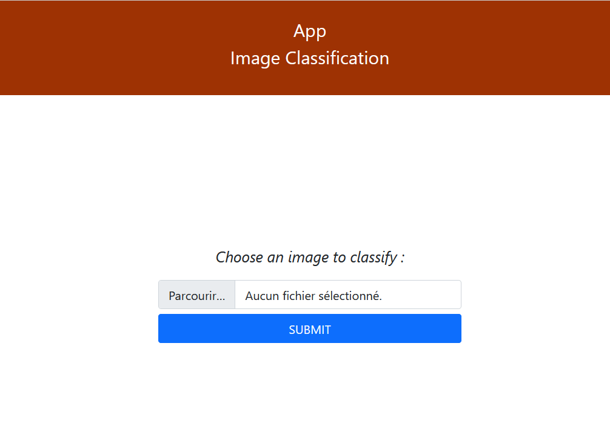
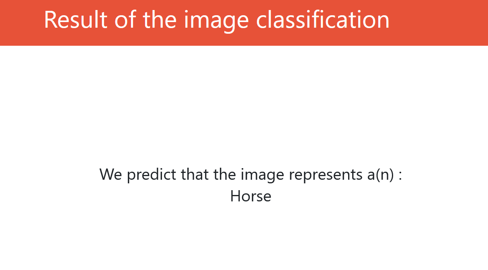

# Image-detection
Image Detection Application using Transfer Learning with VGG19 model, Tensorflow and FastAPI.

Creation of an application to perform an image classification. I use CIFAR 10 dataset from Tensorflow with 10 images to classify ("Airplane","Automobile", "Bird", "Cat", "Deer", "Dog", "Frog", "Horse", "Ship", "Truck"). For the transfer learning model, I used VGG19 model. For the Backend, I used FastAPI and Tensorflow for the modelling part.

# Prediction example
Here is an example with an horse image.
## Home Page

## Negative review

## Positive review

